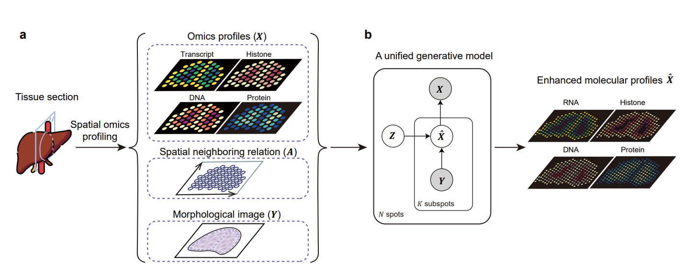
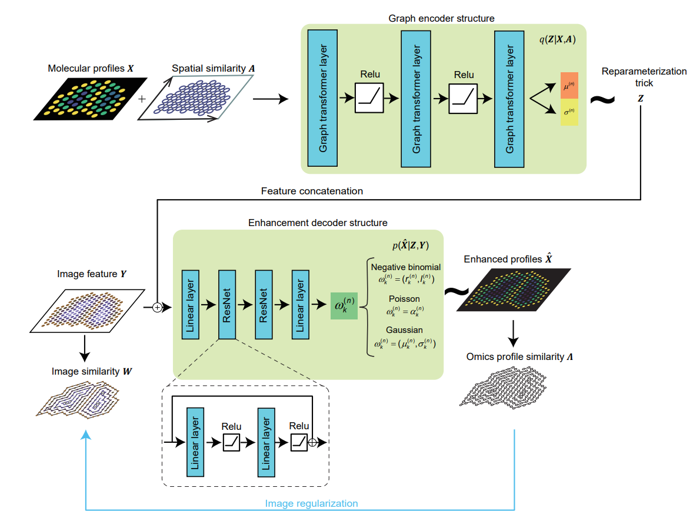

# Tissue characterization at an enhanced resolution across spatial omics platforms with a unified deep generative model

Spatial omics scope (soScope) is a unified generative framework designed for enhancing data quality and spatial resolution across various omics types obtained from diverse spatial technologies.

## Overview

Spatial Omics technologies are transforming the way to study tissue structures and offering valuable insights across various biological areas. However, there remain two challenges in the field. Firstly, tissues are often in frozen or formalin-fixed and paraffin-embedded (FFPE) states before sequencing, potentially impacting molecular states and reducing sequencing accuracy. Secondly, most spatial technologies utilize spatial barcodes at the tissue spot resolution, limiting spatial resolution in tissue structure.

 To address these challenges, we introduce spatial omics scope (soScope), a generative framework that enhances spatial resolution and data quality by modeling spot-level profiles from diverse spatial omics technologies. SoScope views each spot as an aggregation of "subspots" at an enhanced spatial resolution, integrating omics profiles, spatial relations, and high-resolution morphological images through a multimodal deep learning framework, enabling accurate modeling and reduction of variations in diverse spatial omics types.


> **Fig. 1 | An overview of the study.** (**a**) The soScope framework. soScope integrates molecular profiles ($X$), spatial neighboring relations ($A$), and morphological image features ($Y$) from the same tissue using a unified generative model to enhance spatial resolution and refine data quality for diverse spatial omics profiles. (**b**) The probabilistic graphical model representation of soScope. Each of the   spots in the spatial data is considered an aggregation of   subspots at a higher spatial resolution. The subspot omics profile (${\hat X}$) depends on both the latent states ($Z$) at the spot level and image features ($Y$) at the subspot level. The observed profile is obtained by summing profiles from its subspots.



> **Fig. 2 | The model architecture of soScope.** The model includes three parts: Firstly, at the spot resolution, omics profile ($X$), and their spatial neighboring relations ($A$) are encoded by a 3-layer graph transformer and mapped to parameters (${\mu} ^{(n)}$ and ${\sigma} ^{(n)}$ for spot $s^{(n)}$) defining the latent distribution for $Z$ . Spatial states $Z$ are sampled via the reparameterization trick. Secondly, at the subspot resolution, image patches from subspot regions are converted into deep features $Y$ and concatenated with the spot representation $Z$. Thirdly, the combined input is mapped to distribution parameters ${\omega}_k ^{(n)}$ for subspots’ profiles ${\hat X}$ through two sequential ResNet blocks. Here, ${\omega}_k ^{(n)}$ represents likelihood parameters for the  $k$-th subspot enhanced from the $n$-th spot, which is determined by the omics type . An additional image regularization term is used to encourage the consistency between enhanced profile similarity (${\Lambda}$) and morphological similarity ($W$) at the subspot level (blue line).

## soScope software package

soScope requires the following packages for installation:

- Python >= 3.6
- PyTroch>= 1.8.0
- PyG >= 1.7.2 
- Numpy >= 1.16.2
- Scipy = 1.10.1
- scikit-learn = 1.2.0

All required python packages can be installed through `pip/conda` command. 

To install soScope package, use

```terminal
git clone https://github.com/deng-ai-lab/soScope
```

## Usage

### Image feature inception

By running `image_inception.py` on image patches,  users can get 2048-dimensional image feature  ($Y$) .

### Graph building

By running `BuildGraph.py` on spatial profiles and image feature,  users can get spatial neighboring relations ($A$) and morphological similarity ($W$) in coordinate format.

### Import soScope python package

After installation, import soScope by

```python
from soScope_model.train import two_step_train  # for model training
from soScope_model.inference import infer  # for enhanced profiles inference
```

### Train soScope on multimodal data

soScope requires spatial profiles ($N\times G$),  spatial neighboring relations ($3\times \# edges$ , a sparse matrix in coordinate format) ,  image features ($NK\times 2048$), and image similarity matrix ($3\times \Nedges$ , a sparse matrix in coordinate format) for model training. All of these data should be provided in  `data_dir`. After optimization, the soScope model is saved in `saved_model`.

```python
saved_model = two_step_train(logging,
                             vgae_experiment_dir,
                             soScope_experiment_dir,
                             data_dir,
                             vgae_config_file,
                             soScope_config_file,
                             device,
                             checkpoint_every,
                             backup_every,
                             epochs,
                             num_neighbors=4
                            )
```
where 

```
Args:
    logging: not None to log the summary in the training process.
    vgae_experiment_dir: saving directory for pre-training stage.
    soScope_experiment_dir: saving directory soScope training.
    data_dir: dataset directory contains necessary data mentioned above.
    vgae_config_file: model configuration for variational graph auto-encoder used in pre-training stage.
    soScope_config_file: model configuration for soScope.
    device: 'cuda' or 'cpu'
    checkpoint_every: save the model in each check point.
    backup_every: update the model in each backup point.
    epochs: training epoches.
    num_neighbors: edges are built between every neighboring {num_neighbors} nodes, not to be revised. num_neighbors=6 for 			Visium and num_neighbors=4 for other platforms.

Returns:
	Optimized soScope model.

```

### Inference enhanced spatial omics profiles

After optimization, users can directly get enhanced spatial profiles.

```python
infer(
        experiment_dir,
        non_negative,
        num_neighbors,
        data_dir,
        result_dir,
        device,
        saved_model
)
```

where

```
Args:
    experiment_dir:  saving directory for inference stage.
    non_negative: True to make the enhanced profiles not negative.
    num_neighbors: edges are built between every neighboring {num_neighbors} nodes, not to be revised. num_neighbors=6 for 			Visium and num_neighbors=4 for other platforms.
    data_dir: dataset directory contains necessary data mentioned above.
    result_dir: saving directory for results.
    device: 'cuda' or 'cpu'
    saved_model: optimized soScope model for resolution enhancement.

Returns:
	Enhanced spatial profiles saved as {result_dir}/infer_subspot.npy
```

## Demonstration

We provide Jupyter Notebooks (see `soScope_demo`) for the demonstration of applying soScope on the negative binomial distribution, Poisson distribution, Gaussian distribution, and joint distribution for spatial multiomics. The demonstration includes:

1. Data in the aforementioned distribution;
2. Config files for neural networks;
3. Train and inference codes;
4. Visualization of results.

We take the Jupyter Notebooks `soScope_demo/soScope_demo_NB.ipynb` as an example to explain the soScope settings.

#### 1. Data

369 “low-resolution” spots with aggregated gene expressions (X), morphological image features generated from a pretrained Inception-v3 model at high resolution (Y), and spatial neighboring relations (A). Genes analyzed: MT1G, FABP1, EPCAM in the epithelium region; CNN1, MYH11, TAGLN in the muscularis region; PTPRC, HLA-DRA, CD74 in the immune region.

#### 2. Config files for neural networks

vgae_config_file:

```yaml
trainer: VGAETrainer_NB 
# We adopt the negative binomial distribution as the prior distribution to pretrain the graph encoder.

params:
  # Number of analyzed genes
  gene_dim: 9
  
  # Number of subspots in each spot
  sub_node: 7
  
  # Dimension of image features
  sub_dim: 2048
  
  # Dimension of latent states
  z_dim: 128
  
  # Optimizer name
  optimizer_name: 'Adam'
  
  # A hyperparameter indicating the variarance of X.
  scale: 10
  
  # Learing rate
  lr: 0.00_1
  
  # Beta is the weight of KL divergence. We offer a warm-up startegy to  optimize log p(x|z) first with a low initial beta at  	 # the first 5000 iterations, and optimize log p(x|z)-beta*KL with a beta=1 after the network is trained 15000 iterations.    	# In practice, we use and suggest a initial beta=1 to optimize the graph varaitional directly.
  beta_start_value: 1
  beta_end_value: 1
  beta_n_iterations: 10000
  beta_start_iteration: 5000
```

soScope_config_file:

```yaml
trainer: soScope_NB
# We adopt the negative binomial distribution as the prior distribution to train soScope.
params:
  # Number of analyzed genes
  gene_dim: 9
  
  # Number of subspots in each spot
  sub_node: 7
  
  # Dimension of image features
  sub_dim: 2048
  
  # Dimension of latent states
  z_dim: 128
  
  # Optimizer name
  optimizer_name: 'Adam'
  
  # A hyperparameter indicating the variance of the white Gaussian noise defined in Method
  scale: 1
  
  # Learing rate
  lr: 0.00_05
  
  # Gamma is the learning rate decay. The network is optimized by lr*loss in the first 5000 iterations
  # and decrease to 0.01*lr*loss after 15000 iterations.
  gamma_start_value: 1
  gamma_end_value: 0.01
  
  # Beta is the weight of KL divergence.
  beta_start_value: 1
  beta_end_value: 1
  beta_n_iterations: 10000
  beta_start_iteration: 5000
```

#### 3. Train and inference codes

#### 4. Visualization of results

See the implementation in  `soScope_demo/soScope_demo_NB.ipynb`.

## Copyright
Software provided as is under **MIT License**.

Bohan Li @ 2023 BUAA and Deng ai Lab

Permission is hereby granted, free of charge, to any person obtaining a copy of this software and associated documentation files (the "Software"), to deal in the Software without restriction, including without limitation the rights to use, copy, modify, merge, publish, distribute, sublicense, and/or sell copies of the Software, and to permit persons to whom the Software is furnished to do so, subject to the following conditions:

The above copyright notice and this permission notice shall be included in all copies or substantial portions of the Software.

THE SOFTWARE IS PROVIDED "AS IS", WITHOUT WARRANTY OF ANY KIND, EXPRESS OR IMPLIED, INCLUDING BUT NOT LIMITED TO THE WARRANTIES OF MERCHANTABILITY, FITNESS FOR A PARTICULAR PURPOSE AND NONINFRINGEMENT. IN NO EVENT SHALL THE AUTHORS OR COPYRIGHT HOLDERS BE LIABLE FOR ANY CLAIM, DAMAGES OR OTHER LIABILITY, WHETHER IN AN ACTION OF CONTRACT, TORT OR OTHERWISE, ARISING FROM, OUT OF OR IN CONNECTION WITH THE SOFTWARE OR THE USE OR OTHER DEALINGS IN THE SOFTWARE.

